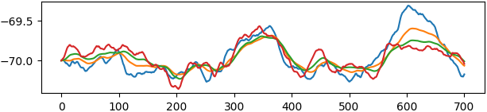

# **nobrianer**

  

[Brian2](https://briansimulator.org/) exercises with a focus on dendrites.

## Acknowledgment

These are my solutions to a translated and slightly-modified version of exercises by [Michalis Pagkalos](https://www.github.com/mpgl).
If you are interested in dendrites and spiking neural networks, check out [dendrify](https://github.com/Poirazi-Lab/dendrify).

## Helpful resources
- [General ephys properties](https://neuroelectro.org/neuron/89/)
- [CA3 pyramidal neuron membrane response](https://doi.org/10.1016/j.neuroscience.2009.01.082)
- [Varying CA3 firing patterns](https://doi.org/10.1002/hipo.20404)
- [AdEx firing patterns](https://doi.org/10.1007%2Fs00422-008-0264-7)
- [Synapses](https://neuronaldynamics.epfl.ch/online/Ch3.S1.html)
- [Modeling somatic and dendritic plasticity](https://doi.org/10.1038/s41467-017-00740-z)
- [Challenging the point neuron dogma](https://doi.org/10.1038/s41467-019-11537-7)
- [Dendrify](https://doi.org/10.1101/2022.05.03.490412)
